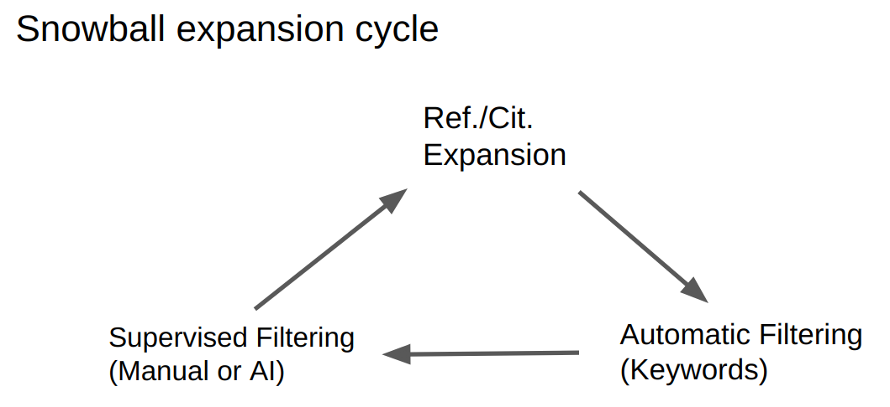

Concepts
========

Snowballing
-----------
Literature or reference snowballing refers to a straightforward algorithm for walking a small part of an academic graph (AG), in order to find **all** articles on a given highly specialized topic. This implies that the result set is connected, i.e., there are no relevant articles that do not refer to or are not cited by the main result set. The size of the resulting set can be in the thousands, with the number of rejected papers in the tens of thousands. In these dimensions supervised filtering is impractical without an automated classification method.

Snowballing is the method of choice for systematic literature reviews, but it is not limited to this application.

Check out the :doc:`literature` section for an exhaustive list of reviews about snowballing. Of course, LitBall was used to find them.

LitBall uses both backward and forward snowballing in the expansion steps. All references and citations are taken into account.

Filters
-------
The size and content of the resulting list of papers depend on the filters that LitBall applies during snowballing. Filters may yield sets of articles that cleanly pass. Still, they may also define a result parameter range for papers that need manual evaluation. In these cases, LitBall presents the list of candidates to the user to decide whether to keep or discard a paper. Automatic and manually discarded articles no longer participate in the subsequent snowballing steps.

While the starter papers, together with the required keywords, determine the topic(s) of the collection, LitBall can use negative filters ("forbidden keywords") to exclude specific types of papers. Finally, the user decides which article to accept and ultimately keep in the supervised filtering step.

In the supervised filtering step Linux users have the option to let a pre-trained ML classifier decide which papers to accept.

Note that the only shipped AI filter in LitBall is geared toward laboratory experimental papers because our use case is biocuration. When discussing biomedical literature, other filters would be necessary for clinical, pharmacological, or epidemiological papers. You might even want to apply LitBall in a different field, and there is no reason LitBall could not be applied there; the specific AI filters would need to be trained. In later versions, this could be done using LitBall.

States of queries
-----------------
Every query is associated with a directory and the files in it. Since the natural processing unit, one round of a query (consisting of 1. expansion, 2. automatic keyword filtering, 3. manual "supervised" filtering) produces two files, an expanded list of accepted papers, and an expanded list of rejected papers, every state after the last filtering---let's call it FILTERED2---in any round is indistinguishable. You can see the start state also as an instance of FILTERED2. It just lacks rejected papers. In conclusion, there are only three alternating states during the query process: *FILTERED2*, *EXPANDED*, and *FILTERED1*. And they can be recognized by looking at the query directory.

A query directory in the *FILTERED2* state, the following action would be to expand the collection by looking for all references/citations of the accepted papers that are not in the rejected list: ::

  XYZ.query
    +---accepted
    +---rejected

A query directory in *EXPANDED* state, the next step would be to apply all completely automatic filters to the expanded list and write the filtered list: ::

  XYZ.query
    +---accepted
    +---rejected
    +---expanded

A query directory in *FILTERED1* state, the next step would be to present the filtered list to the user for supervised filtering, and when finished, add the papers to the accepted and rejected lists, deleting the filtered list: ::

  XYZ.query
    +---accepted
    +---rejected
    +---filtered

