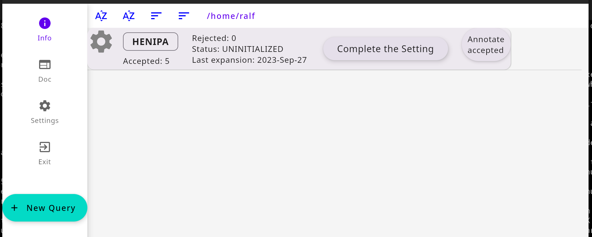
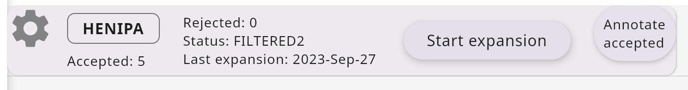
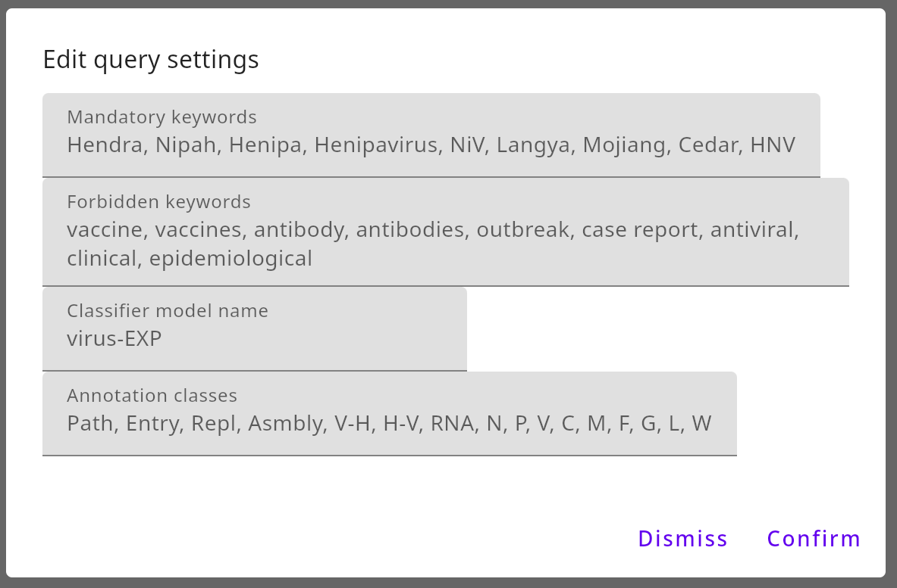
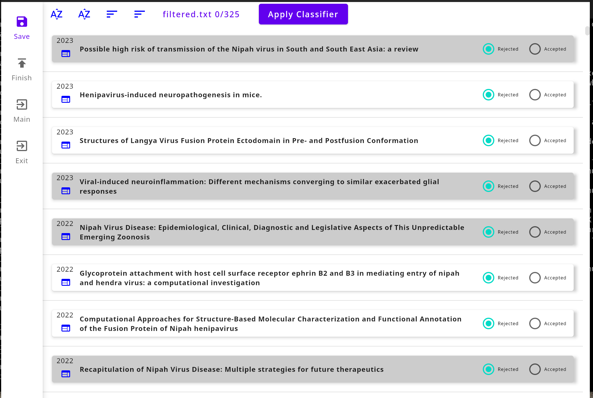
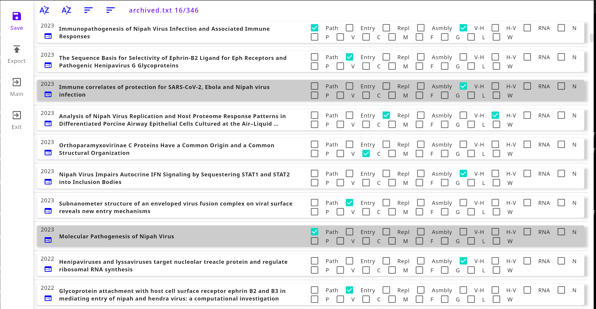

UI Description
==============

Main Screen
-----------

Permanently available components, all specific to the main screen:

 - Rail on the left side, containing:

   - Info button
   - Settings button, see below
   - Exit button
   - New Query button, see below

 - Top bar, with Sorting controls
 - List space (empty after install) containing Query cards, see below

Settings
^^^^^^^^
The Settings button opens the General Settings dialog. Settings consist of ``String``: ``String`` pairs that are saved in the installation directory as JSON file.

 - ``path-to-queries``: absolute path of the directory where your queries will be saved and, on start up, read from. Use this to organise if you have a lot of queries, e.g. create a new directory and change this setting to it, so you can archive the old one. Or switch back and forth.
 - ``directory-prefix``: regarding the single query directories below the above mentioned directory, they get a name consisting of prefix and query name. Install default is ``Query-``.
 - ``path-to-YDF``: on Linux, if you want to use a ML classifier, set this to the path of your YDF installation
 - ``path-to-classifiers``: as per above, the path under which there are ready trained ML classifiers; LitBall ships the ``virus-EXP`` model
 - ``query-sort-type``: permanent sort setting that is changed by clicking on the sorting controls on the main screen
 - ``paper-sort-type``: permanent sort setting that is changed by clicking on the sorting controls on the two paper list screens

New Query
^^^^^^^^^
This button asks you for

 - the name of the to-be-created query. This should be short, optimally an abbreviation
 - one or more DOIs of the core papers, with which the first expansion is performed. Please input the part starting with ``10.`` which all DOIs start with

Query cards
^^^^^^^^^^^

Once you complete the set up of a query (see :doc:`quick`), query cards are visible in the List space of the main screen. They contain (from left):

 - a Settings button for specific query settings, see below
 - the query name, framed and emphasized
 - the string :literal:`Accepted:\ `, indicating the number of papers you chose as core articles, plus all others you accepted later in the Supervised filtering steps. Set in bold if the last round of expansion/filtering didn't get any new papers that you accepted
 - the string :literal:`Rejected:\ `, indicating the number of papers that were rejected during both filtering steps, i.e. those rejected because their title/abstract/TLDR didn't contain one of the mandatory keywords; their title contained one of the forbidden keywords; or they were manually rejected by you
 - the string :literal:`Status:\ `, indicating one of three states the query can be in: ``EXPANDED``, ``FILTERED1``, and ``FILTERED2``
 - the string :literal:`Last expansion:\ `, indicating the last time an expansion was performed
 - the Action button, showing one of three actions: ``Start expansion``, ``Automatic filtering``, or ``Supervised filtering``
 - the Annotate button, which leads you to a paper list screen, showing details of all accepted papers, and where you can put these articles into further categories, and export them

Query Settings
^^^^^^^^^^^^^^

In the query-specific settings dialog, the following can be set:
 - Mandatory keywords. In the automatic filtering step, words from title/abstract/TLDR of articles are matched against these keywords. You must set at least one keyword before expansion
 - (optional) Forbidden keywords. If the article title contains one of these, the paper gets rejected during automatic filtering
 - (optional) Classifier model name. If set, the Apply Classifier button becomes available during Supervised filtering
 - (optional) Annotation classes. Comma-separated names of classes that can be set for each paper in the annotation screen, affecting the export of data

Supervised Filtering Screen
---------------------------

This screen shows
 - a Rail containing

   - Save Button. Saves current list with Rejected/Accepted settings in query directory
   - Finish Button. Finalizes the supervised filtering step. Rejected papers will no longer be considered
   - Main Button. Saves and returns to main screen. You come back by clicking ``Supervised filtering`` again
   - Exit button

 - Top bar, with Sorting controls
 - List space showing titles of all papers that need decision whether to accept them; use the radio buttons to the right. Clicking on the title opens a dialog showing details. On the left of the title, the web page symbol opens in your browser the PubMed or Google Scholar search results for this title.

Annotating Screen
-----------------

This screen shows
 - a Rail containing

   - Save Button. Saves current list with Annotated settings in query directory
   - Export Button. Writes CSV into query directory
   - Main Button. Saves and returns to main screen. You come back by clicking ``Annotate accepted`` again
   - Exit button

 - Top bar, with Sorting controls
 - List space showing titles of all papers that optionally need association with categories; after setting annotation classes in query settings, use the flag boxes to the right. Clicking on the title opens a dialog showing details. On the left of the title, the web page symbol opens in your browser the Google Scholar search results for this title.
